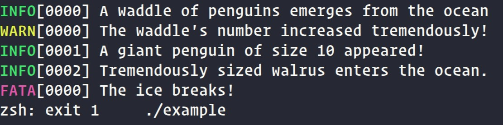

# Loguin :penguin:
Loguin is a simple logging library for C/C++, inspired by a package of a similar name: [Logrus](https://github.com/sirupsen/logrus)



## Installation
1. Clone this repo
```sh
git clone https://github.com/penguingovernor/loguin
```
2. Copy the h and c files to your corresponding src and include directories
e.g. (Assumes that the present directory is the root of this repo)
```sh
cp src/loguin.c my_projects_src_folder/
cp src/loguin.c my_projects_include_folder/
```
## Usage
Loguin has three levels of logging:

| Level 	| Related Functions                   	| Color  	|
|-------	|-------------------------------------	|--------	|
| INFO  	| loguin_printf()<br>loguin_println() 	| Green  	|
| WARN  	| loguin_warnf()<br>loguin_warnln()   	| Yellow 	|
| FATA  	| loguin_fatalf()<br>loguin_fatalln() 	| Red    	|

each function call uses printf's argument structure, so any call to printf can be replaced with any loguin function simply by replacing the function name.

Also an ln version of each function has been added as to avoid typing "\n" at the end of most function calls. 

i.e
```c
printf("Hello world! Today I am %d years old!\n", 20);
// Can be replaced with...
loguin_printf("Hello world! Today I am %d years old!\n", 20);
// Or better yet
loguin_println("Hello world! Today I am %d years old!", 20);
```

NOTE: Any call to fatalf or fatalln is the equivalent of a call to printf/println followed by a call to exit(EXIT_FAILURE) 